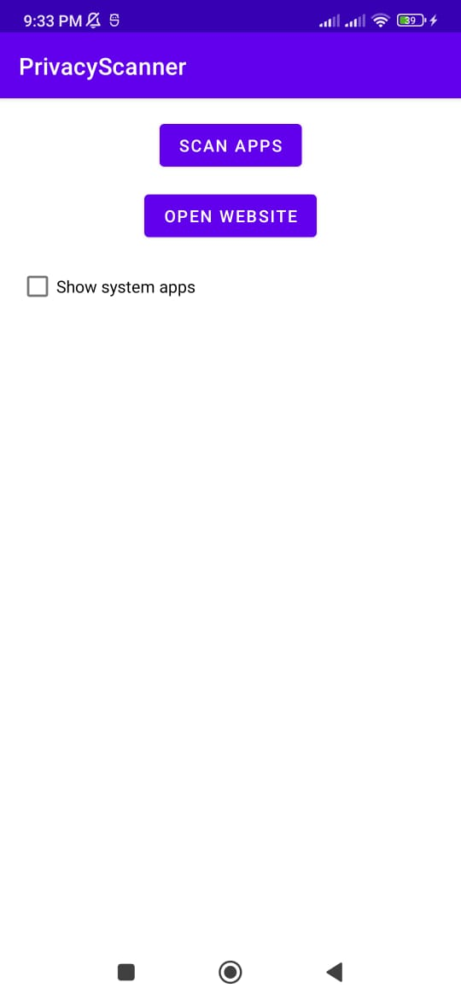
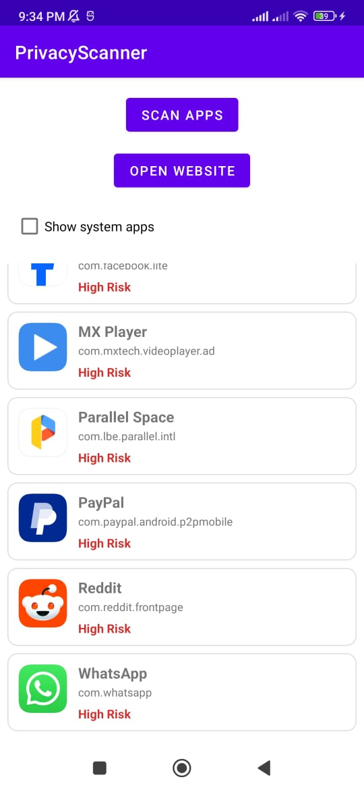
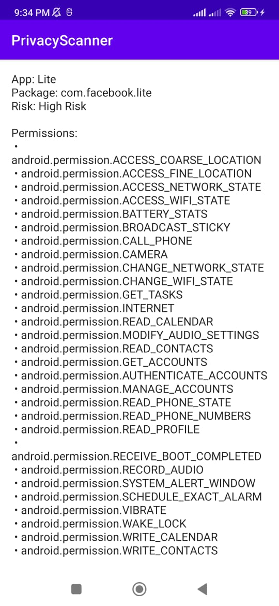
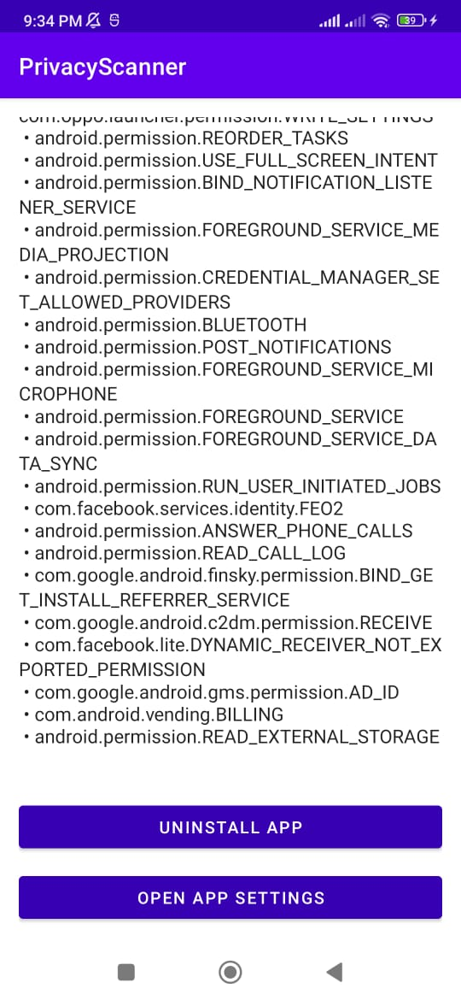

# 🔒 PrivacyScanner  

PrivacyScanner is an Android app built with **Kotlin** that scans installed applications and helps you review their privacy-related details.  

The goal is to give users better visibility into what apps are installed on their device.  
- ✅ 100% Free  
- ✅ No ads  
- ✅ No trackers  
- ✅ Open Source (Apache-2.0 License)  

---

## 📥 Download PrivacyScanner

### Official recommended (privacy-first)
[IzzyOnDroid](https://apt.izzysoft.de/fdroid/index/apk/nodomain.xabd.privacyscanner)  
- Verified and signed APK  
- Privacy-friendly and reproducible build  
- Updates automatically if Izzy’s repo is added to F-Droid  

### Direct GitHub release
[v1.0.1](https://github.com/xabd/PrivacyScanner/releases/tag/v1.0.1)  
- Same APK as IzzyOnDroid  
- For users who prefer downloading directly from the source  

> **Note for privacy-conscious users:** For maximum trust and security, use **IzzyOnDroid**.

[](https://shields.rbtlog.dev/nodomain.xabd.privacyscanner)

---

## 📸 Screenshots  

<p align="center">
  
  
  
  
</p>

---

## 🛠️ Build Instructions  

1. Clone this repository:
   ```bash
   git clone https://github.com/xabd/PrivacyScanner.git
   cd PrivacyScanner


