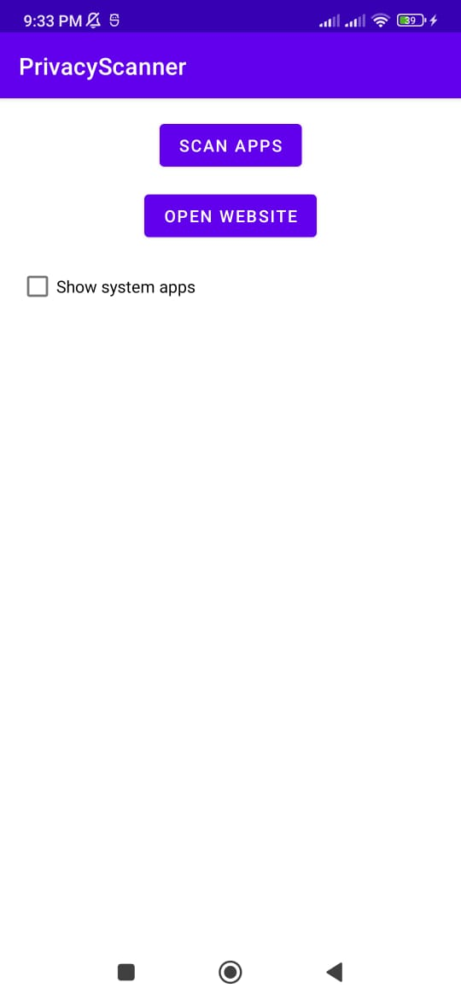
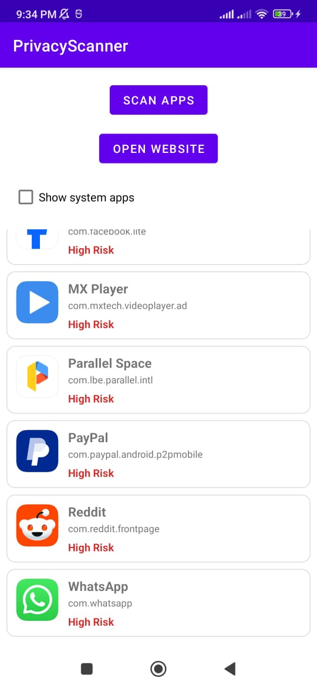
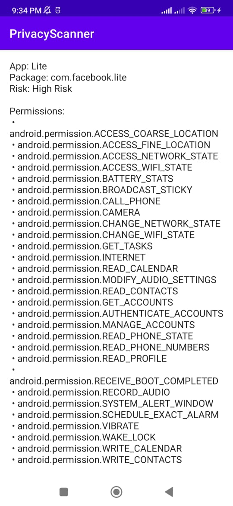
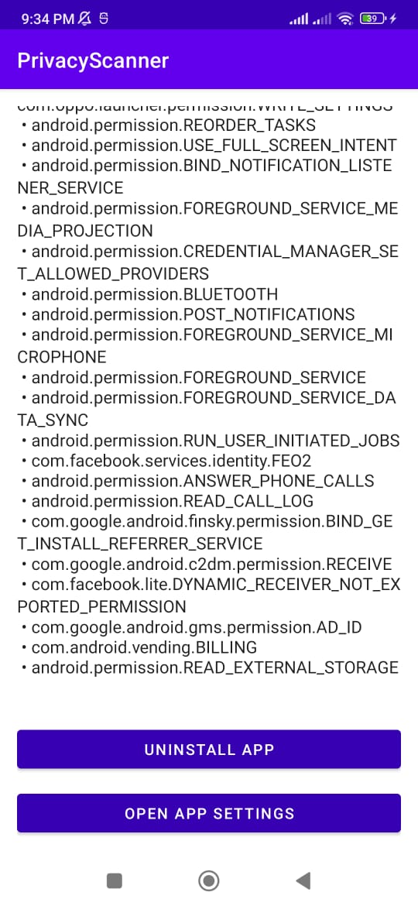

# 🔒 PrivacyScanner  

PrivacyScanner is an Android app built with **Kotlin** that scans installed applications and helps you review their privacy-related details.  

The goal is to give users better visibility into what apps are installed on their device.  

---

## 📸 Screenshots  

  
  
  
  

---

## 📂 Project Structure  

- `app/` → Main Android application source (Kotlin, XML layouts, resources)  
- `gradle/` → Build system files  
- `screenshots/` → App screenshots for documentation  

---

## ⚖️ License  

All rights reserved.  
This project is open for **viewing and learning purposes only**.  
You are not allowed to modify, distribute, or use it without permission.  

---

## 👤 Author  

Created by **[xabd](https://github.com/xabd)**  
