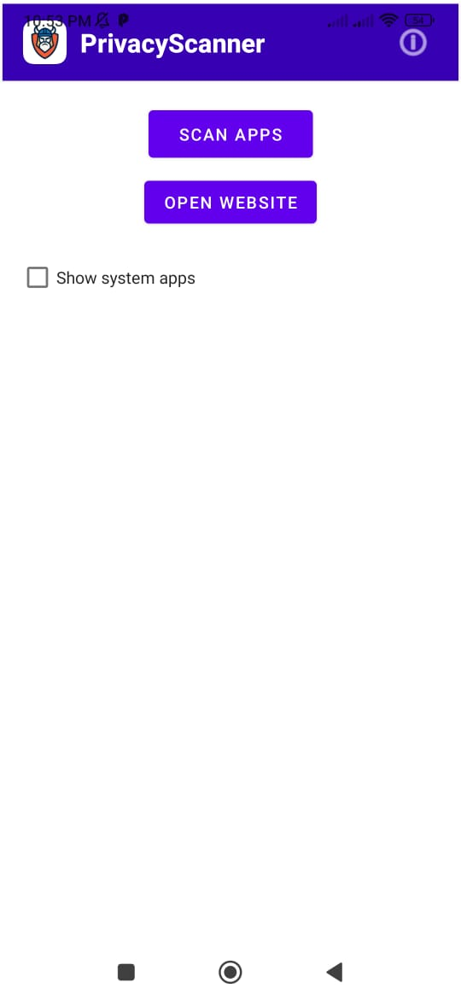
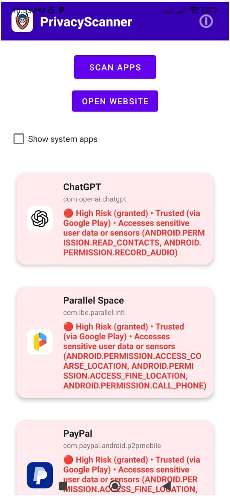
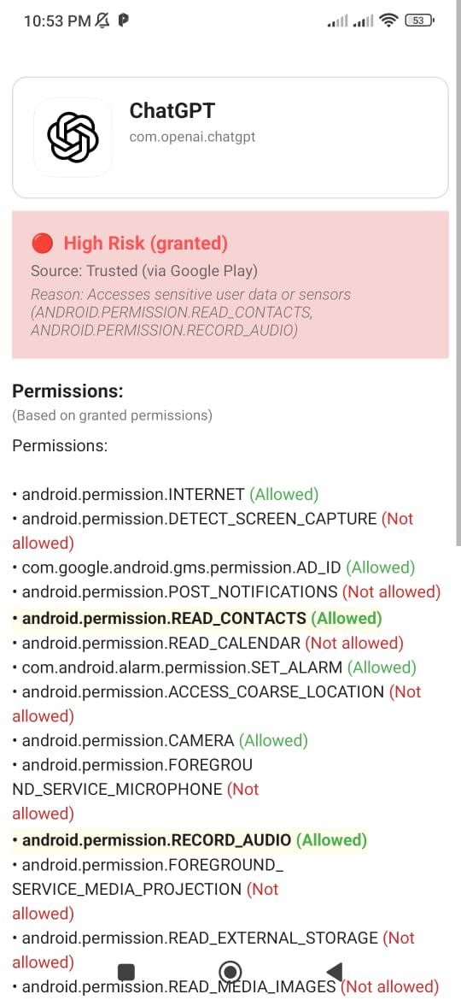
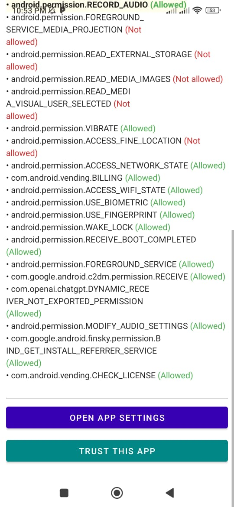

# 🔒 PrivacyScanner  

PrivacyScanner is an Android app built with **Kotlin** that scans installed applications and helps you review their privacy-related details.  

The goal is to give users better visibility into what apps are installed on their device.  

- ✅ 100% Free  
- ✅ No ads  
- ✅ No trackers  
- ✅ Open Source (Apache-2.0 License)  

---

## 📦 Download

<p align="center">
  <a href="https://github.com/xabd/PrivacyScanner/releases">
    
  </a>
  <br/>
  <a href="https://f-droid.org/packages/nodomain.xabd.privacyscanner">
    
  </a>
  <br/>
  <a href="https://apt.izzysoft.de/fdroid/index/apk/nodomain.xabd.privacyscanner">
    
  </a>
</p>

📊 **Downloads:**  


[](https://shields.rbtlog.dev/nodomain.xabd.privacyscanner)

---

## 📲 Install via Obtainium

You can also install and update **PrivacyScanner** easily using **[Obtainium](https://apps.obtainium.im/)** — a privacy-respecting app store that fetches apps directly from their official source (like GitHub).  

### 🧭 Steps to Install:

1. Download and install **Obtainium** from its official website:  
   👉 [https://obtainium.imranr.dev](https://obtainium.imranr.dev)

2. Open the Obtainium app and tap **➕ Add App**.  

3. Choose **Source Type:** `GitHub`.  

4. In the **Source URL** field, paste this link:  
https://github.com/xabd/PrivacyScanner

5. Tap **Add**, and Obtainium will automatically detect the app, fetch releases, and keep it updated for you.

---

## ☕ Support Development  

If you like PrivacyScanner, you can support me here:  
👉 [**Ko-fi.com/DigitalEscape**](https://ko-fi.com/digitalescape)  

Your support helps keep this open-source project alive 💚  

---

## 📸 Screenshots  

<p align="center">




</p>

---
## 🌐 Community

Join our Reddit community:  
👉 **[r/DigitalEscapeTools](https://www.reddit.com/r/DigitalEscapeTools/)**

A place to share open-source tools, privacy-friendly alternatives, de-Googling resources, and ways to regain control over your digital life.
---

## 🛠️ Build Instructions  

1. Clone this repository:
```bash
git clone https://github.com/xabd/PrivacyScanner.git
cd PrivacyScanner
